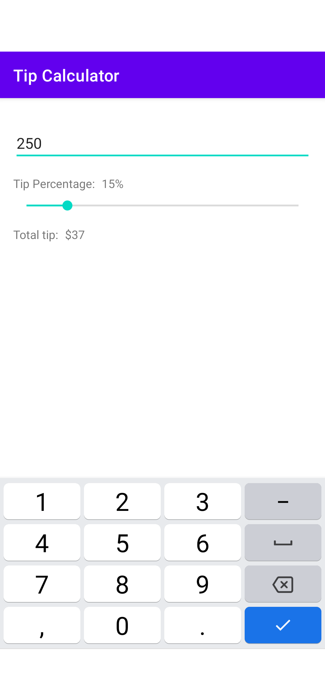

# Tip Calculator

## Table of Contents
* [Description](#description)
* [General information](#general-information)
* [Technologies](#technologies)

## Description

Tipping is a way to show your satisfaction and your gratitude for the service you get. However, 
it's a pain in the neck to calculate the amount of tip, so let's create a handy tool that will 
make it easier!

 

## General information

This repository contains the source code for my take on Jetbrain Academy's Tip Calculator project
in the Kotlin track. It uses Architecture components such as `LiveData` and `ViewModel` and follows
proper implementation of reactive programming.

## Technologies
- Kotlin
- Android SDK and framework
